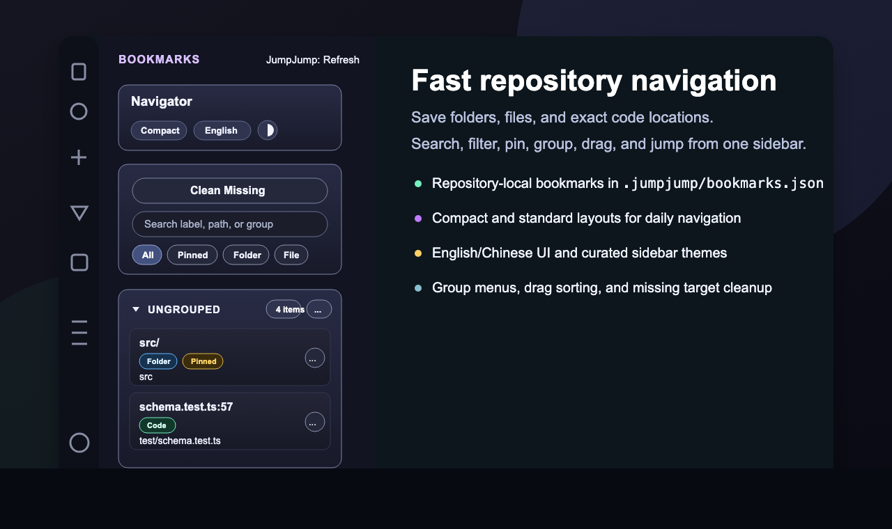
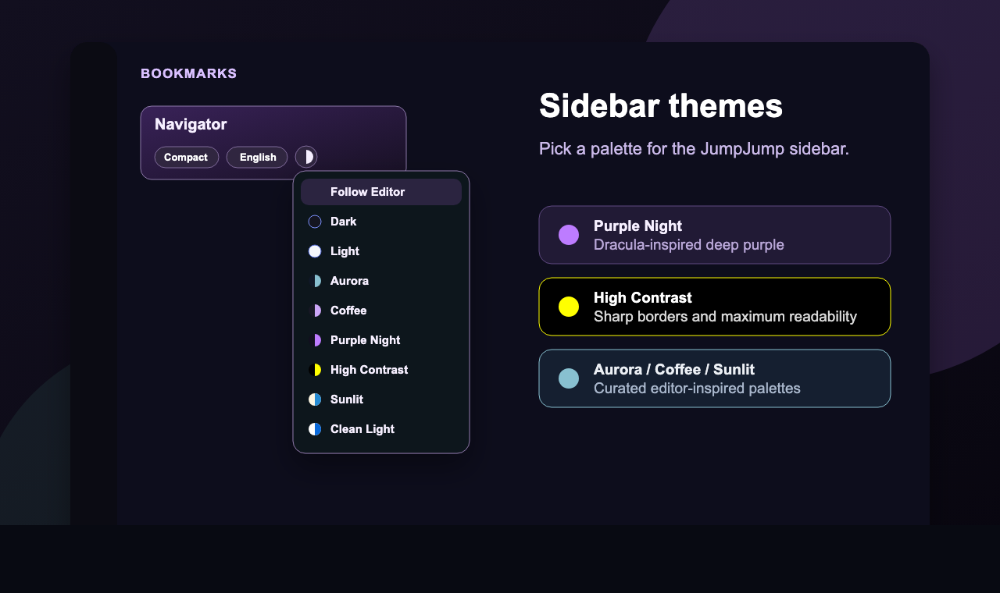
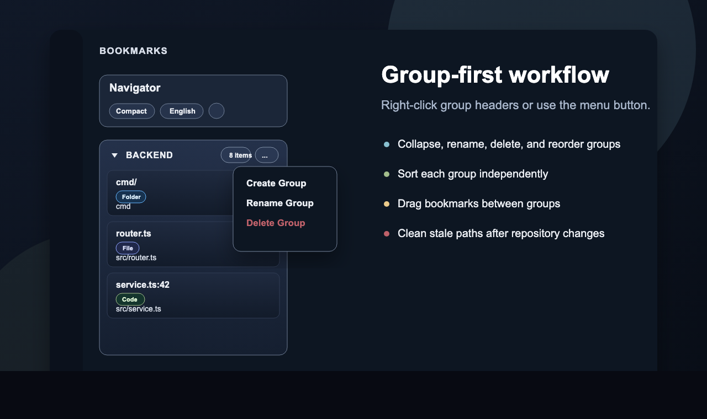

<div align="center">

# JumpJump

### Repository-local navigation for folders, files, and code locations

[](https://marketplace.visualstudio.com/items?itemName=SivanLiu.jumpjump)
[](https://open-vsx.org/extension/SivanLiu/jumpjump)


[](https://marketplace.visualstudio.com/items?itemName=SivanLiu.jumpjump)
[](LICENSE)

English | [简体中文](#简体中文)

</div>

---

## English

JumpJump turns the places you revisit in a repository into a compact, clickable navigation panel for VS Code, Cursor, and other VS Code-compatible editors.

Use it to save important folders, files, and exact code locations, group them by workflow or module, and jump back without repeating Explorer searches.

## Screenshots







## What's New

- Cleaner `Navigator` header with compact/standard mode, language switch, and a themed palette menu.
- Expanded theme set: follow editor, dark, light, Aurora, Coffee, Purple Night, High Contrast, Sunlit, and Clean Light.
- Right-click group headers to open the group menu, in addition to the `...` button.
- Drag bookmarks within a group or across groups; drag sorting switches the target group to manual order.
- Standard mode is quieter by default: the main Add menu is hidden from the toolbar, while empty-state actions and editor/explorer context menus remain available.

## Highlights

- Save folders, files, and line-level code locations as repository bookmarks.
- Use a compact sidebar by default, with a standard mode available from the header.
- Switch the sidebar language between English and Chinese.
- Pick a sidebar theme: follow editor, dark, light, Aurora, Coffee, Purple Night, High Contrast, Sunlit, or Clean Light.
- Add bookmarks from first-level right-click menu actions such as `JumpJump: Add Current File`.
- Search and filter by all, pinned, folder, file, code location, or missing target.
- Pin important bookmarks inside each group.
- Create, rename, delete, collapse, and reorder groups.
- Right-click a group header to open the same group menu as the `...` button.
- Drag bookmarks within a group or between groups. Drag sorting automatically switches the destination group to manual order.
- Move a bookmark to another group from the bookmark menu.
- Clean missing bookmarks after files or folders are moved or deleted.

## Quick Start

1. Install `JumpJump` from the VS Code Marketplace.
2. Open a single repository folder in VS Code or Cursor.
3. Click the JumpJump icon in the Activity Bar.
4. Add a file, folder, or code location from a right-click menu.
5. Organize bookmarks into groups when the list starts to grow.

## Add Bookmarks

JumpJump contributes first-level context menu actions:

| Where you right-click | Available actions |
| --- | --- |
| Editor tab or title area | `JumpJump: Add Current File`, `JumpJump: Add Current Folder` |
| Editor content area | `JumpJump: Add Current Location`, `JumpJump: Add Current File`, `JumpJump: Add Current Folder` |
| Explorer file | `JumpJump: Add Current File` |
| Explorer folder | `JumpJump: Add Current Folder` |

`Add Current Location` saves the active file and cursor line. It is intentionally available from the editor content area, where the current line is meaningful.

## Sidebar Workflow

- Click a bookmark to open it.
- Use `...` on a bookmark to open, pin or unpin, move to group, rename, or delete it.
- Use the group header to collapse or expand a group.
- Use `Sort` on a group to choose manual, label, created time, updated time, or type sorting.
- Drag a group header to reorder custom groups.
- Drag bookmark cards to reorder them or move them between groups.

Drag-and-drop ordering is available when the list is not filtered by search or type.

## Display Preferences

The sidebar header includes:

- `Mode`: switch between compact and standard layouts.
- `Language`: switch between English and Chinese.
- Theme button: choose a palette for the sidebar.

Compact mode is the default layout. It keeps the sidebar dense for daily navigation while still exposing search, filters, groups, and bookmark actions. Theme choices are intentionally local to JumpJump's sidebar, so they can match your workflow without changing the whole editor theme.

## Bookmark Storage

Bookmarks are stored in the current repository:

```text
.jumpjump/bookmarks.json
```

This means:

- Each repository has its own bookmark set.
- Bookmarks can be committed to Git when you want shared team navigation.
- Bookmarks are not uploaded to a remote service by JumpJump.

User preferences are separate from bookmark data:

- Language and theme are stored as editor-level extension state.
- Compact mode is stored as the VS Code/Cursor user setting `jumpjump.compactMode`.

## Current Limits

- JumpJump works with one workspace folder at a time.
- Code location bookmarks use `file path + line number`.
- Saved line numbers may drift after large edits.
- Function, class, and symbol-level bookmarks are not supported yet.

## Development

```bash
npm install
npm run lint
npm test
npm run build
```

Package a local VSIX:

```bash
npm run package:vsix
```

## Privacy

JumpJump stores bookmark data locally in the current repository and does not send it to any remote service.

## Bug Reports

Report issues here: <https://github.com/SivanCola/JumpJump/issues>

## License

JumpJump is licensed under the Apache License, Version 2.0. See [LICENSE](LICENSE).

---

<a id="简体中文"></a>

## 简体中文

JumpJump 会把你在一个仓库里反复访问的位置整理成 VS Code、Cursor 以及其他兼容编辑器侧边栏里的可点击导航。

你可以收藏重要目录、文件和精确代码位置，把它们按工作流或模块分组，然后不用反复在资源管理器里搜索，直接跳回目标位置。

## 最新版亮点

- 顶部改为更简洁的「导航」区域，集中放置紧凑/标准模式、语言切换和主题菜单。
- 主题扩展为：跟随编辑器、深色、浅色、极光、咖啡、紫夜、高对比度、日光、清爽浅色。
- 分组标题支持右键菜单，和右侧 `...` 菜单保持一致。
- 支持书签组内拖拽排序、跨分组拖拽移动，拖拽后目标分组自动切到手动排序。
- 标准模式减少常驻说明和 Add 工具入口，保留搜索、筛选、分组管理和右键添加入口。

## 功能亮点

- 将目录、文件和精确到行的代码位置保存为仓库书签。
- 默认使用紧凑侧边栏，也可以从顶部切换到标准模式。
- 侧边栏界面支持英文和中文切换。
- 侧边栏主题支持：跟随编辑器、深色、浅色、极光、咖啡、紫夜、高对比度、日光、清爽浅色。
- 通过一级右键菜单快速添加书签，例如 `JumpJump: Add Current File`。
- 支持按全部、置顶、目录、文件、代码位置、失效目标进行搜索和筛选。
- 支持在每个分组内部置顶重要书签。
- 支持创建、重命名、删除、折叠和拖拽调整分组。
- 右键分组标题可以打开和 `...` 按钮一致的分组菜单。
- 支持在同一分组内拖拽书签，也支持跨分组拖拽移动；拖拽排序会自动把目标分组切换为手动排序。
- 可以从书签菜单把书签移动到其他分组。
- 文件或目录移动、删除后，可以一键清理失效书签。

## 快速开始

1. 安装 `JumpJump`。
2. 在 VS Code 或 Cursor 中打开一个单仓库目录。
3. 点击 Activity Bar 里的 JumpJump 图标。
4. 通过右键菜单添加常用文件、文件夹或代码位置。
5. 当书签列表变多后，把它们整理到不同分组里。

## 添加书签

JumpJump 提供一级右键菜单入口：

| 右键位置 | 可用操作 |
| --- | --- |
| 编辑器标签页或标题区域 | `JumpJump: Add Current File`、`JumpJump: Add Current Folder` |
| 编辑器内容区域 | `JumpJump: Add Current Location`、`JumpJump: Add Current File`、`JumpJump: Add Current Folder` |
| 资源管理器文件 | `JumpJump: Add Current File` |
| 资源管理器文件夹 | `JumpJump: Add Current Folder` |

`Add Current Location` 会保存当前文件和光标所在行。它有意放在编辑器内容区域，因为只有在那里当前行才有明确含义。

## 侧边栏工作流

- 点击书签即可打开目标位置。
- 使用书签上的 `...` 可以打开、置顶或取消置顶、移动到分组、重命名或删除书签。
- 点击分组标题可以折叠或展开分组。
- 使用分组上的 `Sort` 可以选择手动、名称、创建时间、更新时间或类型排序。
- 拖拽分组标题可以调整自定义分组顺序。
- 拖拽书签卡片可以在分组内排序，也可以移动到其他分组。

只有在列表没有被搜索或类型筛选时，拖拽排序才会启用。

## 显示偏好

侧边栏顶部包含：

- `Mode`：在紧凑布局和标准布局之间切换。
- `Language`：在英文和中文之间切换。
- 主题按钮：选择 JumpJump 侧边栏自己的配色。

紧凑模式是默认布局。它会保持侧边栏的信息密度，适合日常导航，同时仍然保留搜索、筛选、分组和书签操作。主题选择只影响 JumpJump 侧边栏，不会改变整个编辑器主题。

## 书签存储

书签数据保存在当前仓库中：

```text
.jumpjump/bookmarks.json
```

这意味着：

- 每个仓库都有自己的书签集合。
- 如果希望团队共享导航，可以把书签文件提交到 Git。
- JumpJump 不会把书签上传到远程服务。

用户偏好和书签数据分开存储：

- 语言和主题保存为编辑器级扩展状态。
- 紧凑模式保存为 VS Code/Cursor 用户设置 `jumpjump.compactMode`。

## 当前限制

- JumpJump 一次只支持单工作区目录。
- 代码位置书签使用 `文件路径 + 行号`。
- 大幅编辑文件后，已保存的行号可能发生偏移。
- 暂不支持函数、类、符号级书签。

## 开发

```bash
npm install
npm run lint
npm test
npm run build
```

打包本地 VSIX：

```bash
npm run package:vsix
```

## 隐私

JumpJump 会把书签数据保存在当前仓库本地，不会发送到任何远程服务。

## Bug 反馈

- 提交地址：<https://github.com/SivanCola/JumpJump/issues>

## 许可证

JumpJump 使用 Apache License, Version 2.0 授权。详见 [LICENSE](LICENSE)。
